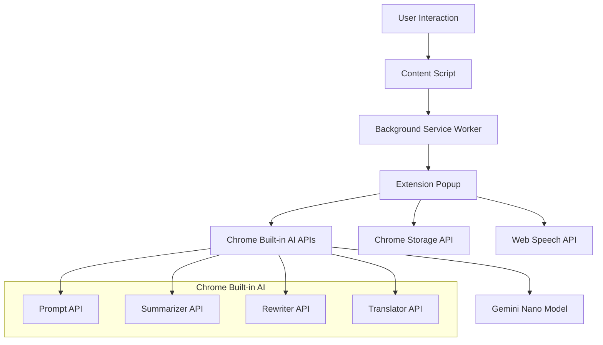

# Design Document

## Overview

The Multimodal Accessibility Assistant is a Chrome Extension that leverages Chrome's Built-in AI APIs (Gemini Nano) to provide on-device accessibility features. The system consists of a content script for DOM interaction, a popup interface for user interaction, and a background service worker for coordination. All AI processing happens locally using Chrome's built-in models, ensuring privacy and enabling offline functionality.

## Tech Stack & APIs

### 🧠 Core AI Engine: Gemini Nano
**Gemini Nano is the heart of this project** - Google's on-device AI model that powers ALL accessibility features:

- ✅ **Runs 100% locally** on user's device (CPU/GPU/NPU)
- ✅ **Zero server costs** - no OpenAI API keys or cloud hosting needed
- ✅ **Privacy-first** - user data never leaves their computer
- ✅ **Offline capable** - works without internet after initial download
- ✅ **Free to use** - no usage limits or API costs

**Hardware Requirements for Gemini Nano:**
- **Storage**: 22GB free space for model download
- **Memory**: 16GB+ RAM (CPU) or 4GB+ VRAM (GPU)
- **OS**: Windows 10/11, macOS 13+, Linux, ChromeOS
- **Browser**: Chrome 138+ with Built-in AI enabled

### Chrome Built-in AI APIs (All Powered by Gemini Nano)
Every AI feature uses Gemini Nano through Chrome's Built-in APIs:

- **Prompt API**: `window.ai.languageModel` - 🖼️ Image descriptions + custom multimodal prompts
- **Summarizer API**: `window.ai.summarizer` - 📝 Bullet-point summaries of text content  
- **Rewriter API**: `window.ai.rewriter` - ✍️ ELI5 text simplification
- **Translator API**: `window.ai.translator` - 🌍 Multilingual content translation
- **Proofreader API**: `window.ai.proofreader` - 📖 Grammar and clarity improvements (optional)

**Key Workflow:**
```
User selects text/image → contentScript.js → popup.js 
→ window.ai.[api]() → Gemini Nano (local) → Result displayed
```

### Frontend Technologies
- **Extension Framework**: Chrome Extension Manifest V3
- **Languages**: HTML5, CSS3, JavaScript (ES2020+)
- **UI Styling**: Vanilla CSS (lightweight) or TailwindCSS (rapid development)
- **Build Tools**: Node.js, npm/pnpm (optional for bundling)

### Chrome Extension APIs
- **chrome.scripting**: Inject content scripts and overlays into web pages
- **chrome.storage**: Persist user settings and saved content locally
- **chrome.runtime**: Message passing between extension components
- **chrome.contextMenus**: Right-click menu integration for text/image selection
- **chrome.action**: Extension popup and icon management

### Browser APIs
- **Web Speech API**: `speechSynthesis` - Text-to-speech audio playback
- **Selection API**: `window.getSelection()` - Capture user text selections
- **Canvas API**: Image processing for AI input conversion
- **Fetch API**: Handle image data conversion and processing

### Gemini Nano Model Management
- **Model Availability**: `LanguageModel.availability()` - Check if Gemini Nano is downloaded and ready
- **Model Creation**: `LanguageModel.create()` - Initialize Gemini Nano sessions with progress monitoring
- **Download Progress**: Monitor Gemini Nano download with progress events (first-time setup)
- **Session Management**: Create/destroy AI sessions efficiently to manage memory usage

### Development & Testing Tools
- **Version Control**: Git + GitHub for source code management
- **Testing**: Manual testing with Chrome Developer Mode "Load unpacked"
- **Accessibility Testing**: NVDA, JAWS, VoiceOver screen readers
- **Performance Monitoring**: Chrome DevTools for memory and performance analysis
- **Demo Recording**: Built-in screen recorder or OBS for video creation

### Deployment & Distribution
- **Development**: Chrome Developer Mode with "Load unpacked" extension loading
- **Production**: Chrome Web Store (optional) with extension packaging
- **Documentation**: GitHub Pages or README for installation instructions
- **Demo Platform**: YouTube/Vimeo for demo video hosting

### Gemini Nano API Usage Patterns

#### Text Summarization (Gemini Nano via Summarizer API)
```javascript
// Gemini Nano creates 3-bullet summaries locally
const summarizer = await window.ai.summarizer.create({
  type: 'key-points',        // Generate bullet points
  format: 'markdown',        // Markdown formatting
  length: 'short',          // Concise summaries (≤20 words per bullet)
  sharedContext: 'accessibility content' // Context for better results
});

const summary = await summarizer.summarize(selectedText);
```

#### Text Simplification (Gemini Nano via Rewriter API)
```javascript
// Gemini Nano rewrites complex text for ELI5 understanding
const rewriter = await window.ai.rewriter.create({
  tone: 'casual',           // Friendly, approachable tone
  format: 'plain-text',     // Simple text output
  length: 'medium'          // Appropriate detail level
});

const simplified = await rewriter.rewrite(selectedText, {
  context: 'Explain like I\'m 5 years old'
});
```

#### Image Descriptions (Gemini Nano via Prompt API)
```javascript
// Gemini Nano processes images locally for accessibility
const session = await window.ai.languageModel.create({
  systemPrompt: 'You are an accessibility assistant that creates clear, concise image descriptions.'
});

const prompt = `Describe this image in 2 sentences, focusing on the main subject and any text or chart elements. 
Provide:
1. Alt-text (≤120 characters)
2. Detailed description (1-2 sentences)
Format as JSON: {"alt_text": "...", "description": "..."}`;

const description = await session.prompt(prompt, { image: imageData });
```

#### Translation (Gemini Nano via Translator API)
```javascript
// Gemini Nano translates content locally without cloud APIs
const translator = await window.ai.translator.create({
  sourceLanguage: 'en',     // Auto-detect or specify
  targetLanguage: 'es'      // User-selected target language
});

const translated = await translator.translate(content);
```

#### Complete Workflow Example
```javascript
// Full accessibility processing pipeline using Gemini Nano
async function processContent(selectedText, imageData) {
  // 1. Check if Gemini Nano is available
  const availability = await window.ai.languageModel.availability();
  if (availability !== 'readily') {
    // Handle model download/setup
    await setupGeminiNano();
  }
  
  // 2. Process text with Gemini Nano
  const summary = await window.ai.summarizer.summarize(selectedText);
  const simplified = await window.ai.rewriter.rewrite(selectedText);
  const translated = await window.ai.translator.translate(summary, { to: 'es' });
  
  // 3. Process image with Gemini Nano (if provided)
  let imageDescription = null;
  if (imageData) {
    const session = await window.ai.languageModel.create();
    imageDescription = await session.prompt('Describe this image for accessibility', { image: imageData });
  }
  
  // 4. All processing happened locally on user's device!
  return { summary, simplified, translated, imageDescription };
}
```

### Storage Schema
```javascript
// Chrome storage structure for saved content
{
  savedContent: {
    [id]: {
      timestamp: number,
      type: 'summary' | 'description' | 'simplification' | 'translation',
      originalText: string,
      processedText: string,
      language?: string,
      url: string
    }
  },
  userSettings: {
    preferredLanguage: string,
    ttsVoice: string,
    summaryLength: 'short' | 'medium' | 'long',
    autoSave: boolean
  }
}

## Architecture

### High-Level Architecture



### Component Interaction Flow

1. **Content Script** captures user selections and DOM elements
2. **Background Service Worker** coordinates message passing between components
3. **Extension Popup** handles AI API calls and user interface
4. **Chrome Storage** persists user preferences and saved content
5. **Web Speech API** provides text-to-speech functionality

## Components and Interfaces

### Content Script (contentScript.js)

**Purpose:** Handles DOM interaction and content extraction

**Key Functions:**
- `extractSelectedText()`: Captures user text selections
- `extractImageData()`: Gets image URLs and base64 data for AI processing
- `injectContextMenu()`: Adds right-click menu options
- `showInlineOverlay()`: Displays results directly on the page

**Message Interface:**
```javascript
// Messages sent to background script
{
  type: 'TEXT_SELECTED',
  data: { text: string, selection: Range }
}

{
  type: 'IMAGE_SELECTED', 
  data: { imageUrl: string, imageData: string, alt: string }
}
```

### Background Service Worker (background.js)

**Purpose:** Coordinates communication between content script and popup

**Key Functions:**
- `handleContentScriptMessage()`: Routes messages from content scripts
- `handlePopupMessage()`: Routes messages from popup
- `manageModelAvailability()`: Checks and manages AI model status

**Storage Management:**
```javascript
// Saved content structure
{
  id: string,
  timestamp: number,
  type: 'summary' | 'description' | 'simplification' | 'translation',
  originalContent: string,
  processedContent: string,
  language?: string
}
```

### Extension Popup (popup.js)

**Purpose:** Main user interface and AI processing hub

**Key Functions:**
- `checkModelAvailability()`: Verifies AI model status
- `generateSummary()`: Uses Summarizer API for text summarization
- `simplifyText()`: Uses Rewriter API for ELI5 simplification
- `describeImage()`: Uses Prompt API for image descriptions
- `translateContent()`: Uses Translator API for language conversion
- `playAudio()`: Manages text-to-speech playback

**AI API Integration:**
```javascript
// Summarizer API usage
const summarizer = await Summarizer.create({
  type: 'key-points',
  format: 'markdown',
  length: 'short'
});

// Prompt API for image descriptions
const session = await LanguageModel.create();
const result = await session.prompt(
  "Describe this image in 2 sentences, focusing on main subject and any text. Provide alt-text (≤120 chars) and detailed description.",
  { image: imageData }
);
```

### User Interface Components

**Popup Layout:**
- Header with extension title and model status indicator
- Content area showing selected text/image
- Action buttons (Summarize, Simplify, Describe, Translate)
- Results display area with formatting
- Audio controls and save options
- Settings and help links

**Accessibility Features:**
- Full keyboard navigation with Tab order
- ARIA labels and roles for screen readers
- High contrast mode support
- Focus indicators and skip links
- Semantic HTML structure

## Data Models

### Content Selection Model
```javascript
interface ContentSelection {
  type: 'text' | 'image';
  content: string;
  metadata: {
    url: string;
    timestamp: number;
    elementType?: string;
    alt?: string;
  };
}
```

### AI Response Model
```javascript
interface AIResponse {
  type: 'summary' | 'description' | 'simplification' | 'translation';
  content: string;
  confidence?: number;
  language?: string;
  metadata: {
    processingTime: number;
    modelVersion: string;
  };
}
```

### Saved Content Model
```javascript
interface SavedContent {
  id: string;
  timestamp: number;
  originalContent: ContentSelection;
  processedContent: AIResponse;
  userNotes?: string;
  tags?: string[];
}
```

## Error Handling

### Model Availability Errors
- **Model Not Available**: Show download prompt with progress indicator
- **Insufficient Storage**: Display storage requirements and cleanup options
- **Hardware Incompatible**: Provide fallback options and system requirements

### AI Processing Errors
- **Malformed Response**: Display raw output with retry option
- **Processing Timeout**: Show timeout message with retry button
- **Content Too Large**: Suggest breaking content into smaller chunks

### Network and Permissions Errors
- **Content Script Injection Failed**: Offer manual content input option
- **Storage Quota Exceeded**: Implement automatic cleanup with user consent
- **TTS Not Available**: Provide visual-only fallback mode

### Error Recovery Strategies
```javascript
// Graceful degradation pattern
async function processWithFallback(content, primaryAPI, fallbackAPI) {
  try {
    return await primaryAPI(content);
  } catch (error) {
    console.warn('Primary API failed, trying fallback:', error);
    try {
      return await fallbackAPI(content);
    } catch (fallbackError) {
      return { error: 'Processing unavailable', originalContent: content };
    }
  }
}
```

## Testing Strategy

### Unit Testing
- **Content Script Functions**: Test DOM manipulation and message passing
- **AI API Integration**: Mock API responses and test error handling
- **Storage Operations**: Test save/load functionality with various data sizes
- **Audio Playback**: Test TTS integration across different browsers

### Integration Testing
- **End-to-End Workflows**: Test complete user journeys from selection to output
- **Cross-Component Communication**: Verify message passing between all components
- **Model Download Process**: Test first-time setup and model availability checks
- **Offline Functionality**: Verify features work without network connection

### Accessibility Testing
- **Screen Reader Compatibility**: Test with NVDA, JAWS, and VoiceOver
- **Keyboard Navigation**: Verify all functionality accessible via keyboard
- **Color Contrast**: Ensure WCAG 2.1 AA compliance
- **Focus Management**: Test focus order and visual indicators

### Performance Testing
- **AI Response Times**: Measure processing latency for different content sizes
- **Memory Usage**: Monitor extension memory footprint during operation
- **Storage Efficiency**: Test storage usage patterns and cleanup
- **Battery Impact**: Measure power consumption during AI processing

### Browser Compatibility Testing
- **Chrome Versions**: Test on Chrome 138+ with Built-in AI support
- **Operating Systems**: Verify functionality on Windows, macOS, and Linux
- **Hardware Variations**: Test on different CPU/GPU configurations
- **Model Availability**: Test behavior when models are unavailable

### User Acceptance Testing
- **Accessibility Users**: Test with visually impaired and dyslexic users
- **Accuracy Assessment**: Evaluate AI output quality with target users
- **Usability Metrics**: Measure task completion rates and user satisfaction
- **Performance Benchmarks**: Verify response times meet requirements (<3s average)

## Security Considerations

### Privacy Protection
- All AI processing happens on-device with no external API calls
- No user content transmitted to remote servers
- Clear privacy notices explaining local processing
- Optional telemetry with explicit user consent

### Content Security
- Sanitize all user input before AI processing
- Validate AI responses before displaying to users
- Implement content filtering for inappropriate outputs
- Secure storage of saved content with encryption

### Extension Security
- Minimal permissions requested (activeTab, scripting, storage)
- Content Security Policy to prevent XSS attacks
- Secure message passing between components
- Regular security audits and dependency updates